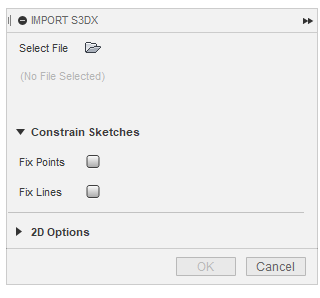
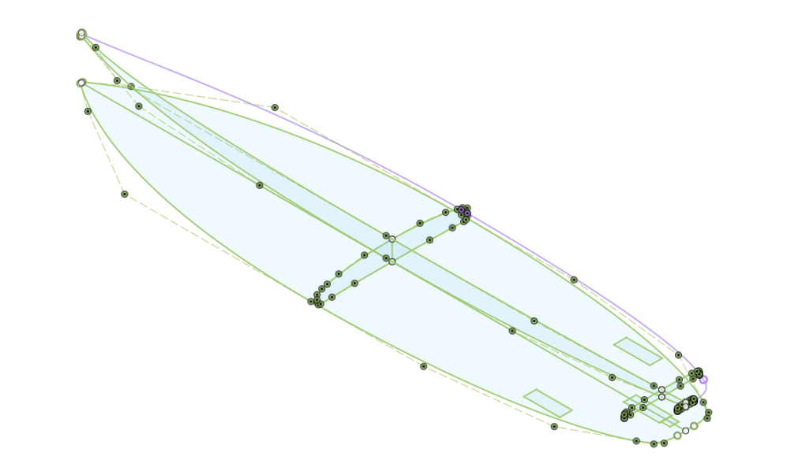
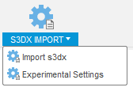

# S3DtoFusion

S3DtoFusion is a Fusion360 Add-In allowing to import s3dx savefiles from Shape3d X.

## Important Note

I am aware of the fact Shape3d X offers a "3D Export" option and this Add-In might look like a way to get around the (from a hobby-shaper's perspective "massive") investment for that option to purchase. But please keep in mind: While loading the File, some slight modifications to lines and points are necessary to persuade Fusion to do what I want. Also there are some approximations done due to some fusion-internals I can not overcome and some assumptions are made how Shape3d X does, means or handles things. This Add-In is strictly made for the DIY community, who want to play around with the 3D model in Fusion360 (But please, if you can afford it, buy [the standart version](https://www.shape3d.com/Products/Design.aspx) and give the devs some love) and **NOT** for professional Shapers. Also, take a look at the [known issues](#known-issues) and [file requirements](#file-requirements) to see if your board is able to be loaded properly.

## How To Install

As this Add-In is still in early development, there is no official Fusion360 installer. You have to add the Add-In manually.

You have two Options, [manual](#manual) or [semi-auto](#semi-auto):

### Semi-Auto

Install the installer-script from the Fusion360 AppStore:
[Install scripts or addins from GitHub](https://apps.autodesk.com/FUSION/en/Detail/Index?id=789800822168335025&os=Win64&appLang=en)

Start Fusion (this works even with Fusion360 currently running) and press `Shift + S`

Click `GitHubToFusion360` and press `Run` or doubleclick.

Paste this url into the textfield:

    https://github.com/0xhexdec/S3DtoFusion

and hit `OK`, now its all set up.

### Manual

Firstly, download the latest [release](https://github.com/0xhexdec/S3DtoFusion/releases) of the Add-In.

Unzip the dowloaded file and rename the folder `S3DToFusion-x.y.z` to `S3DToFusion`, simply remove the version number.

Navigate to your Fusion 360 AddIns folder, (typically found here on Windows `%appdata%\Autodesk\Autodesk Fusion 360\API\AddIns`) and copy the `S3DToFusion` folder into the AddIns folder.

Start Fusion360 and navigate to the `Scripts and AddIns` dialog box by pressing `Shift + S` or navigating to `UTILITIES -> ADD-INS`. Choose the `Add-Ins` tab on the top left and click on the little green plus icon next to `My Add-Ins`. A file chooser should open in the AddIns directory. Select the `S3DToFusion` folder and click `Select Folder`.

Select the `S3DToFusion` Add-In in the list under `My Add-Ins` and click on `Run` in the lower right. You can choose to run the Add-In automatically on startup by checking the `Run on Startup` checkbox. If you don't do this, you have to manually start the Add-In after each restart of Fusion 360 (by pressing `Shift + S` -> Add-Ins Tab -> click `S3DToFusion` -> click `Run`)

## Using S3DtoFusion

Create a blank Fusion 360 Design, navigate to `UTILITIES` and click on `S3DX IMPORT` (either the Icon or the dropdown's `Import s3dx` entry).

The Command Dialog opens (*look may differ*):

Choose your s3dx file (the file needs to comply with [file requirements](#file-requirements)), set the options to your liking and hit OK. The Add-In will do its best to create some useful data for you. This may take a while depending on your selected options.

This is a preview how *the blank* surfboard looks like.

## Features

Current features are:

+ Importing the modifiable 2D Bezier curves (Apex, Deck, Rail, Stringer Top/Bottom, etc)
+ Creating 3D Bezier Curves for modifiable curves (Apex, Deck, Rail, etc) - See [file requirements](#file-requirements)
+ Importing the Boxes (Finboxes, Leashplugs, etc) as 2D Sketches
+ Importing the Slices

## Feature Roadmap

The ultimate goal is to loft the Board to a 3D Body. But this may take some time.

## File Requirements

Due to the (strange) fact that Shape3d X saves all *visible* curves into the save file, but non-visable curves not (except for some special curves), it is important that you make all *modifiable* curves visible in the outline AND side views and than save the file to disc.

*Modifiable* curves are all curves you can modify within the slice view (at least Apex, Rail, Deck 1). You can make all curves visible if you like, they get imported to fusion then, but other curves than the *modifiable* ones are not necessary.

Disable all kinds of file protection!

## Known Issues

+ selecting different rocker planes has no effect
+ The Sketches are a **MESS**!
+ Starting the AddIn takes some time and Fusion is unresponsive during this time. I am not 100% sure why but a big reason is that I have to download a python package in the background. Will fix this someday.
+ every form of "Non continuous" in the stringer or outline makes fusion to freak out, best to use the **Tangent-Type: Continuous** only (the type where both handles are fixed to each other) I try to work around this limitation in the future.
+ the current bodies are used for a workaround, it's not that I like it that way

## Current Limits

+ I only own the standard license. therefore, not features from any higher versions are available (like Asymmetric designs, 3D Layers, ...)

## Q&A

### I found a Bug, what now?

Yay, another one. Please report the bug by creating an [issue](https://github.com/0xhexdec/S3DtoFusion/issues).

### The AddIn does not start
If its the first time you tried this, it may have something to do with the downloading of some packages, which is done on startup. It may be not as robust as I hoped for. Try to start the AddIn again, maybe multiple times but normally, the second start should result in a different outcome. Otherwise... BUUUGGG!!!

### I can't see the 3D Options

**Important Note**: *The 3D body creation feature is in such a early state that I deactivated it completly. Please wait for a future update.*

If you want to play with sneek-peeks of the development, try some `Experimental Settings`, these are always subject to change and I can't guarante for anything, neither material nor life.

Experimental features are prone to crashing, not stable and/or behaving weird. DO NOT EXPECT THEM TO WORK! Be happy if they do.

### The Board and the lines are not where they should be

I use Fusion in **Z-UP** mode, it can have an impact in how some lines are placed. Create an issue if this happens, I will try to fix it.

### My file does not load

Probably a bug, create an Issue and *PLEASE* attach your .s3dx file to the Issue. If you don't want to have it public, we will find a way how you can send it to me. If your file is *confidential*, you shouldn't use this plugin in the first place!

## Why an Add-In and not a Script?

The current Add-In does indeed only provide script features. There are no background monitoring tasks but as this might be subject to change, I choose to set the project up as a Add-In and if needed, I don't have to deal with migrating from Script to Add-In.
